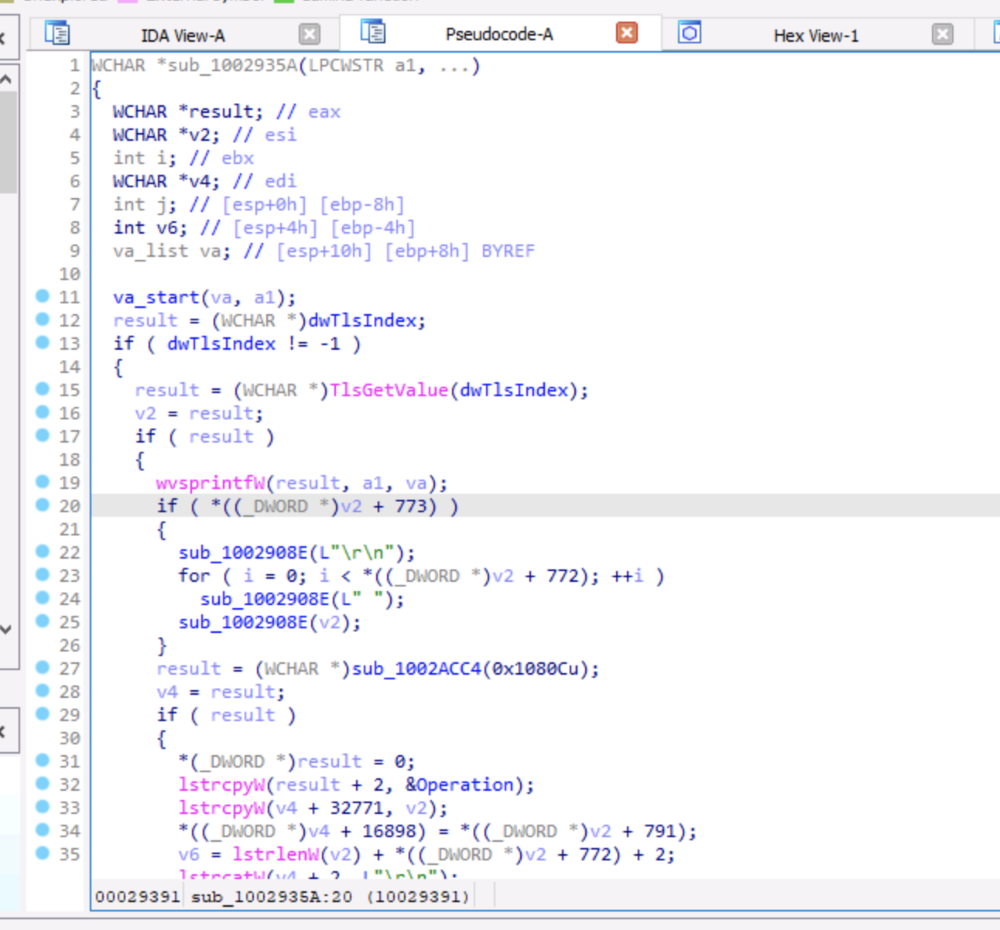

## Monthys Three History
* Industrial malware, used stegonagraphy and C2 communication over legit cloud services.
* Natural language artifacts suggest it was developed by Russian-speaking authors, though the accounts mention pretend to be Chinese.
* Targets Cyrillic Windows versions

## Decompilation
* Open the sample in IDA and add the c headers that came with the sample through *File -> Load File -> C Headers*
* We can go to the DLL Main function and generate psuedo-code, and we see that there are two functions based on the `fdwReason == 1` or not. This doesn't provide much helpful information, so if we press *CTRL+E* or go to the *Exports* window, we'll see that other than DLL Main, there's an `Open()` function which calls our DLL.
* Looking at the two methods that are called first, `sub_10029287` and `sub_1002935A` we see some checks for values are very large offsets of incoming bytes. As well as the familar call to `TlsGetValue` that we saw referenced in the DLL Main function.

* If we look at the references for `sub_1002ACC4` we'll see that this is our TLS Struct Allocator. It allocates a certain number of bytes, in this case `0xC60h` bytes aka 3168 bytes
* We then see that it pulls some environment variables out of `%APPDATA%\\Microsoft\\Credentials\\`, concats some other variables, and then prints out the name of a dat value, calling TlsSetValue with whast it printed. So we can rename the function to `InitFillTls` and see where else it's used.
* Looking at references to the `InitFillTls` function, we see it's used at `StartAddress()`

We see that there is some algorithm in her that does some offset math and eventually writes out to a log file, so we can rename this function to `WriteLogFile`
* In the last function of `StartAddress` we see `sub_1002A5FE` which is the meat of this malware. First it creates a log file called `ProcessCmdLine`, sets so Windows variables like `SetErrorMode`
* Around line 110 of the decompiled code we see where the malware gets its name, we see an if statement where the arglist contains a string *MT3RESTART* as well as a reference do *bliss.bmp*
* We can see all the references to `SetTlsField` in this method along with other methods that are being called immediately before or after.
* One method is called `sub_1002B380` which when examined, looks like it writes out to the log bmp data. And then we find the algorithm for generating the bmp.
* To examine what the incoming arguments are, we can highlight the argument and press *ALT+UP KEY* and we see the incoming argument `(int)hMem` gets assigned in `sub_10029824` where the first parameter for that method is a filename, the second being our variable that gets passed in, which appears to be the contents of said file.
* We can use the same idea to get the other parameters, the next being the size of the file in bytes.
* Since we know what the file contents are now, and we know it's a bitmap file, we can import the local type called `BitmapFileStruct`, highlight the type of our variable `FileContents` and press *Y* to rename the type to `BitmapFileStruct` as shown below:

Now we have a strongly typed file and can see what variables within the object are being used easier.
